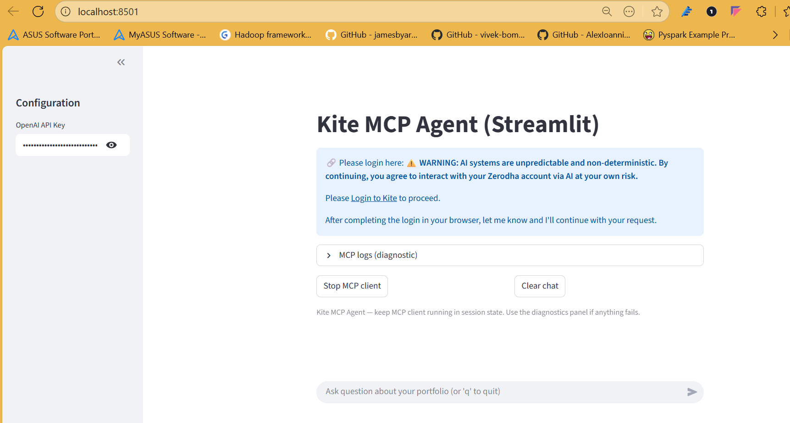

Here’s a complete **README.md** you can drop into your repo **AI-AGENTS-WITH-MCP**.
I’ve woven in the **uv setup**, prerequisites (Python 3.12+), and structured it around your three scenarios + Streamlit app.

---

# AI-AGENTS-WITH-MCP

**Building AI Agents with Model Context Protocol (MCP) and Amazon Bedrock**

This repository contains a set of **end-to-end examples** demonstrating how to build decoupled, agentic AI systems using:

* **Amazon Bedrock** (Anthropic Claude models)
* **Model Context Protocol (MCP)** for tool decoupling
* **Strands** framework for agent orchestration
* **uv** for fast Python environment + dependency management
* **Streamlit** for a real-world demo with Zerodha Kite MCP

It follows the concepts from the article *“Building AI Agents with MCP and Amazon Bedrock: An Implementation Guide”* and showcases:

1. **Baseline agents** with Bedrock models
2. **Local tool integration**
3. **Single MCP server connection**
4. **Multi-MCP orchestration**
5. **Custom MCP server** (Calculator example)
6. **Streamlit Kite portfolio assistant**

---

## 🚀 Prerequisites

* **Python 3.12+** installed on your system
* **uv** (fast Python package installer & runner)

Install `uv`:

```bash
pip install uv
```

Verify:

```bash
uv --version
```

---

## 🛠️ Setup Instructions

Clone the repo:

```bash
git clone https://github.com/<your-username>/AI-AGENTS-WITH-MCP.git
cd AI-AGENTS-WITH-MCP
```

Create a Python 3.12 virtual environment with **uv**:

```bash
uv venv --python 3.12
```

Activate the environment:

**Linux/macOS**

```bash
source .venv/bin/activate
```

**Windows (PowerShell)**

```powershell
.venv\Scripts\activate
```

Install dependencies:

```bash
uv pip install -r requirements.txt
```

---

## 📂 Project Structure

```
AI-AGENTS-WITH-MCP/
├── README.md
├── requirements.txt
├── scenario1_single_server/   # Scenario 1: Baseline agent + local tool + doc MCP server
│   ├── baseline_agent.py
│   ├── agent_with_local_tool.py
│   └── agent_with_doc_mcp.py
├── scenario2_multi_server/    # Scenario 2: Multi-MCP orchestration
│   └── multi_server_agent.py
├── scenario3_custom_server/   # Scenario 3: Custom MCP server
│   ├── calculator_server.py
│   └── calculator_client.py
├── kite_streamlit_app/        # Real-world Streamlit + Kite MCP demo
│   └── streamlit_app.py
└── utils/                     # Shared helpers
    └── streamlit_helpers.py
```

---

## 📖 Scenarios

### 1. Single MCP Server

* **Baseline agent** with Claude (Bedrock)
* Add a **local tool** (e.g., Python execution)
* Connect to AWS Documentation MCP server (`awslabs.aws-documentation-mcp-server`)

Run:

```bash
python scenario1_single_server/agent_with_doc_mcp.py
```

---

### 2. Multi-MCP Orchestration

Agent with access to **AWS Documentation** + **AWS Pricing MCP servers**.
Use case: Generate SageMaker fine-tuning research report.

Run:

```bash
python scenario2_multi_server/multi_server_agent.py
```

---

### 3. Custom MCP Server

Example of building your own MCP server (Calculator):

Start server:

```bash
python scenario3_custom_server/calculator_server.py
```

Run client:

```bash
python scenario3_custom_server/calculator_client.py
```

---

### 4. Streamlit Kite Portfolio Assistant

Interactive app integrating with **Kite MCP** and OpenAI GPT-4o.

Run:

```bash
streamlit run kite_streamlit_app/streamlit_app.py
```

Enter your **OpenAI API key** in the sidebar, log in to Zerodha Kite when prompted, and start asking portfolio questions.

📸 Example UI:



---

## ⚡ Using `uvx` for MCP servers

MCP servers are launched using `uvx`. Example:

```bash
uvx --from awslabs.aws-documentation-mcp-server@latest awslabs.aws-documentation-mcp-server.exe
```

Your agent code uses this under the hood.

---

## 📚 Learn More

* [Model Context Protocol (MCP)](https://modelcontextprotocol.io)
* [Amazon Bedrock](https://aws.amazon.com/bedrock/)
* [Strands](https://pypi.org/project/strands-agents/)

---

## ✍️ Author & Articles

This repo accompanies the Medium article:
➡️ *“Building AI Agents with MCP and Amazon Bedrock: An Implementation Guide”*

Follow-up post on LinkedIn coming soon 🚀

---

## 📜 License

MIT License. Use freely with attribution.

